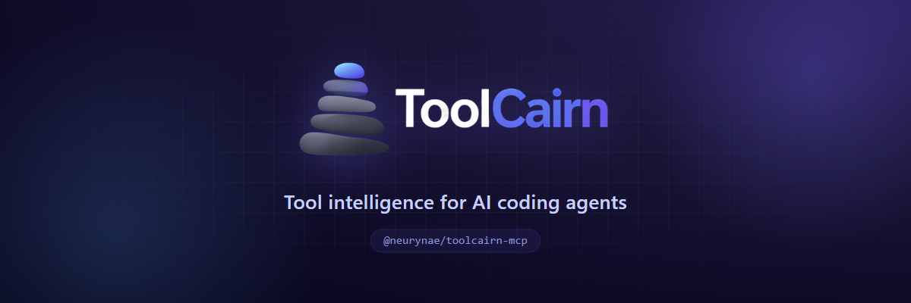
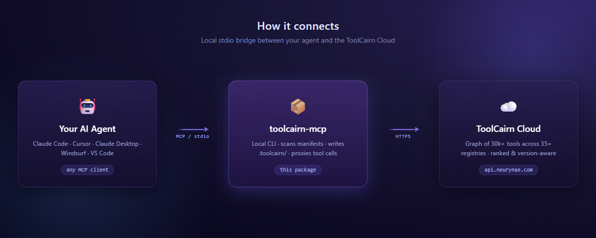

<p align="center">
  <a href="https://toolcairn.neurynae.com">
    
  </a>
</p>

<p align="center">
  <a href="https://www.npmjs.com/package/@neurynae/toolcairn-mcp"></a>
  <a href="https://www.npmjs.com/package/@neurynae/toolcairn-mcp"></a>
  <a href="./LICENSE"></a>
  <a href="https://nodejs.org"></a>
</p>

<p align="center">
  <a href="https://registry.modelcontextprotocol.io/v0/servers?search=io.github.neurynae/toolcairn-mcp"></a>
  <a href="https://smithery.ai/server/@neurynae/toolcairn-mcp"></a>
  <a href="https://glama.ai/mcp/servers"></a>
  <a href="https://mcp.directory"></a>
</p>

# `@neurynae/toolcairn-mcp`

> Source for [`@neurynae/toolcairn-mcp` on npm](https://www.npmjs.com/package/@neurynae/toolcairn-mcp). Install via the package, not from this repo.

ToolCairn is an MCP server that connects your AI coding agent to a continuously-updated graph of **30,000+ open-source tools** across npm, PyPI, Cargo, Maven, Go, Composer, RubyGems, NuGet, Homebrew, and **35+ more registries**. Search, compare, build stacks, and check version compatibility — all from inside Claude Code, Cursor, or any MCP-compatible client.

> **Concrete example.** Your agent receives *"I need a fast HTTP client for Node"* → it calls `search_tools` → ToolCairn returns ranked candidates with maintenance and community signals, alternatives, and a warning if the top pick has questionable activity. No more guessing from blog posts and stale tutorials.

<p align="center">
  
</p>

The MCP server runs locally as a stdio child of your agent. Tool calls travel over MCP to this package, which proxies the network-bound ones to the ToolCairn Cloud API and handles the local-only ones (project scan, config, audit log) on disk.

---

## Why ToolCairn?

Plain web search and LLM training data are insufficient for tool selection — knowledge cutoffs miss latest releases, search engines surface tutorials over authoritative ranking, and version-compatibility answers live in scattered issue threads.

ToolCairn fixes this with three things you can't get from raw registry APIs:

- **Graph-aware ranking** — recommendations consider how tools relate to each other (dependencies, integrations, replacements, conflicts), not just popularity.
- **Version-aware compatibility** — declared peer ranges and cross-registry version metadata give you *"Next.js 14 needs React 18.x"* instead of *"they're both popular, probably fine?"*
- **A continuous learning loop** — every accepted, rejected, or replaced recommendation feeds back into the graph, so quality improves with use.

---

## Quick Start

**Step 1.** Create a free account at **[toolcairn.neurynae.com/signup](https://toolcairn.neurynae.com/signup)**.

**Step 2.** Add to your MCP config and restart your agent:

```json
{
  "mcpServers": {
    "toolcairn": {
      "command": "npx",
      "args": ["@neurynae/toolcairn-mcp"]
    }
  }
}
```

**Step 3.** A browser window opens for sign-in on first start. Once you confirm, all tools are available immediately — no further setup.

Requires **Node.js 22+**.

---

## Setup — Claude Code

The fastest path:

```bash
claude mcp add toolcairn -- npx @neurynae/toolcairn-mcp
```

Or paste the JSON block above into `~/.claude/claude_desktop_config.json` under `mcpServers`.

> Other MCP-compatible clients (Cursor, Claude Desktop, VS Code Copilot, Windsurf, Zed, …) work with the same `npx @neurynae/toolcairn-mcp` command — see the [docs](https://toolcairn.neurynae.com/docs) for client-specific config locations.

---

## What you can do

### Find a tool
Your agent receives *"I need a real-time analytics database for event tracking"* → calls `search_tools` → gets ranked candidates (ClickHouse, TimescaleDB, InfluxDB, …) with maintenance signals. If the intent is ambiguous, the response carries clarification questions; the agent answers via `search_tools_respond` and gets refined results.

### Build a stack
Your agent receives *"Help me architect a full-stack TypeScript SaaS"* → calls `refine_requirement` to decompose, then `get_stack` with the per-layer needs → gets a 3–5 tool stack (web framework + database + auth + payments) with a **version-compatibility matrix** showing which versions work together across the stack.

### Compare options
*"Express vs Fastify for a REST API?"* → `compare_tools` returns side-by-side health (stars, maintenance score, last commit, open issues, contributor trends), graph relationships (what each integrates with, what they replace), and a recommendation grounded in your stated use case.

### Check version compatibility
*"I want to upgrade Next.js to 14 but keep React 17."* → `check_compatibility` evaluates declared peer ranges and returns satisfied/unsatisfied checks with the source (`declared_dependency` / `graph_edges` / `shared_neighbors`).

### Track project tools
On first session, `toolcairn_init` walks your repo, parses every manifest (`package.json`, `requirements.txt`, `pyproject.toml`, `Cargo.toml`, `go.mod`, `pom.xml`, `Gemfile`, `composer.json`, …), classifies each tool against the ToolCairn graph, and writes a local `.toolcairn/` snapshot. Subsequent sessions read this snapshot first — your agent stops re-searching for things it already knows about.

---

## Available Tools

The MCP server exposes 15 tools, grouped by purpose. Most are local (no network) or fire-and-forget; the search, compare, and stack tools call the ToolCairn API.

### Discovery

| Tool | What it does |
|---|---|
| `search_tools` | Natural-language search with health signals and alternatives. May ask clarifying questions when intent is ambiguous. |
| `search_tools_respond` | Submit answers to refine an in-progress search. |
| `refine_requirement` | Decompose a vague use-case ("build a SaaS") into specific, searchable sub-needs. |
| `verify_suggestion` | Check whether the agent's tool picks are actually indexed in the ToolCairn graph. |

### Stacks & Compatibility

| Tool | What it does |
|---|---|
| `get_stack` | Compose a complementary tool stack with a cross-version compatibility matrix. |
| `compare_tools` | Head-to-head: health metrics, graph relationships, and a recommendation. |
| `check_compatibility` | Version-aware peer-range check between two tools. |

### Project Configuration

| Tool | What it does |
|---|---|
| `toolcairn_init` | Discover project roots, scan manifests, classify tools, write `.toolcairn/`. |
| `read_project_config` | Load the local `.toolcairn/config.json` snapshot (confirmed tools, pending items, audit log). |
| `update_project_config` | Atomically add, remove, or update a tool — every mutation is audited. |

### Feedback Loop

| Tool | What it does |
|---|---|
| `report_outcome` | Fire-and-forget: did the recommended tool work out? Closes the learning loop. |
| `suggest_graph_update` | Submit a new tool, edge, or use-case for admin review (staged, never auto-promoted). |
| `check_issue` | **Last resort.** Search a tool's GitHub issues for known bugs — only after 4+ retries and a docs review. |

### Session

| Tool | What it does |
|---|---|
| `classify_prompt` | Local: decide whether a tool search is needed at all (skips ToolCairn for non-tool prompts). |
| `toolcairn_auth` | Manage local sign-in: `login` / `status` / `logout`. |

---

## Configuration

| Environment variable | Default | Purpose |
|---|---|---|
| `TOOLCAIRN_TRACKING_ENABLED` | `true` | Set `false` to disable usage event logging (see [Privacy](#privacy--telemetry)). |
| `LOG_LEVEL` | `info` | Set `debug` for verbose stdio diagnostics. |
| `MCP_TRANSPORT` | `stdio` | Set `http` for HTTP transport (advanced). |

### Where things live

- **Credentials** → `~/.toolcairn/credentials.json` (mode `0600`, 90-day expiry).
- **Per-project state** → `.toolcairn/{config.json, audit-log.jsonl, tracker.html}` at each detected project root.

The `tracker.html` file is a self-contained dashboard — open it in any browser to see every tool call, pending evaluation, and audit entry in real time.

---

## Session management

Your sign-in lives at `~/.toolcairn/credentials.json` and lasts 90 days. From inside your agent:

```
toolcairn_auth { action: "status" }   # check current sign-in
toolcairn_auth { action: "logout" }   # clear credentials
```

To re-authenticate, simply restart your agent — the sign-in flow opens automatically.

---

## Privacy & telemetry

We're explicit about what leaves your machine.

**Sent to ToolCairn** (when tracking is enabled):
- Tool name, duration, and success/error status — for service health and product analytics.
- **Never** full prompts, response bodies, or project file contents.

**Stays local:**
- Every audit entry (`.toolcairn/audit-log.jsonl`).
- Project state and tool snapshots.
- Your credentials file.

**Opt out at any time:**

```bash
TOOLCAIRN_TRACKING_ENABLED=false
```

Tools still work normally; only the lightweight usage events are skipped.

Full privacy policy: [toolcairn.neurynae.com/privacy](https://toolcairn.neurynae.com/privacy).

---

## Troubleshooting

**Browser doesn't open for sign-in.** Copy the URL printed to stderr and visit it manually; enter the device code shown.

**`Module not found` or version errors.** Confirm Node 22+ with `node --version`.

**Behind a corporate proxy.** Set `HTTPS_PROXY` — `npx` and the MCP server respect it.

**Self-hosted backend.** Set `TOOLPILOT_API_URL=https://your-host`.

**Sign-in expired.** Restart your agent — the device-code flow re-runs automatically.

**Verbose logs.** Set `LOG_LEVEL=debug`.

**What is the agent doing?** Open `.toolcairn/tracker.html` in your browser for an auto-refreshing dashboard of every tool call.

---

## CLI: `scan`

A standalone health scan that doesn't start the MCP server:

```bash
npx @neurynae/toolcairn-mcp scan [dir]
```

Reads dependency manifests in `[dir]` (default: current directory) — `package.json`, `requirements.txt`, `pyproject.toml`, `Cargo.toml` — and reports health, alternatives, and warnings for each declared dependency.

Add `--json` for machine-readable output.

---

## Links

- **Website:** [toolcairn.neurynae.com](https://toolcairn.neurynae.com)
- **Docs:** [toolcairn.neurynae.com/docs](https://toolcairn.neurynae.com/docs)
- **npm:** [@neurynae/toolcairn-mcp](https://www.npmjs.com/package/@neurynae/toolcairn-mcp)
- **GitHub:** [neurynae/toolcairn-mcp](https://github.com/neurynae/toolcairn-mcp)
- **Issues:** [github.com/neurynae/toolcairn-mcp/issues](https://github.com/neurynae/toolcairn-mcp/issues)
- **Security:** responsible disclosure to `security@neurynae.com`

---

## Contributing

Issues and feature requests are welcome at [github.com/neurynae/toolcairn-mcp/issues](https://github.com/neurynae/toolcairn-mcp/issues).

The graph engine, search pipeline, and indexer are closed-source. This repository contains the public MCP client and project-config layer that runs on user machines.

---

## License

MIT — © 2026 NEURYNAE. See [LICENSE](./LICENSE).
